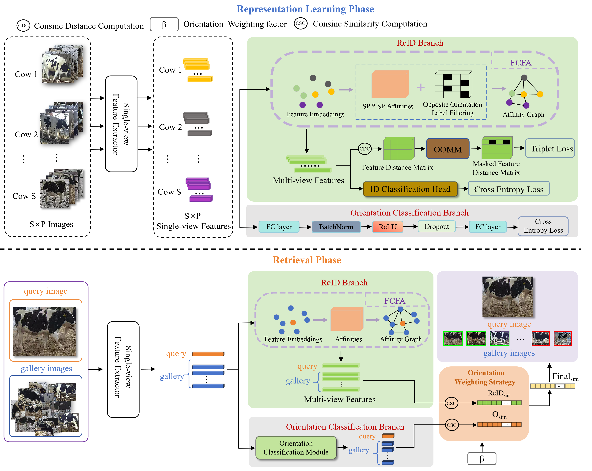

# COWDATASET
A dataset for Dairy Cow Re-Identification
## 🔥 Overview

## 1️⃣ Data
To find the dataset used in this study, please make sure all files are downloaded from [here](https://pan.baidu.com/s/1g81o3IBowflN-Co7IkB6mA)  
Extraction code：please email at bsdai@neau.edu.cn
## 2️⃣ Results
The experimental results are as below.

| Method | Rank-1/% | Rank-5/% | Rank-10/% | mAP/% | mAP-IOPS/% |
|:--:|:--:|:--:|:--:|:--:|:--:|
| FOONet | 96.9 | 98.5 | 100.0 | 47.3 | 75.9 |

